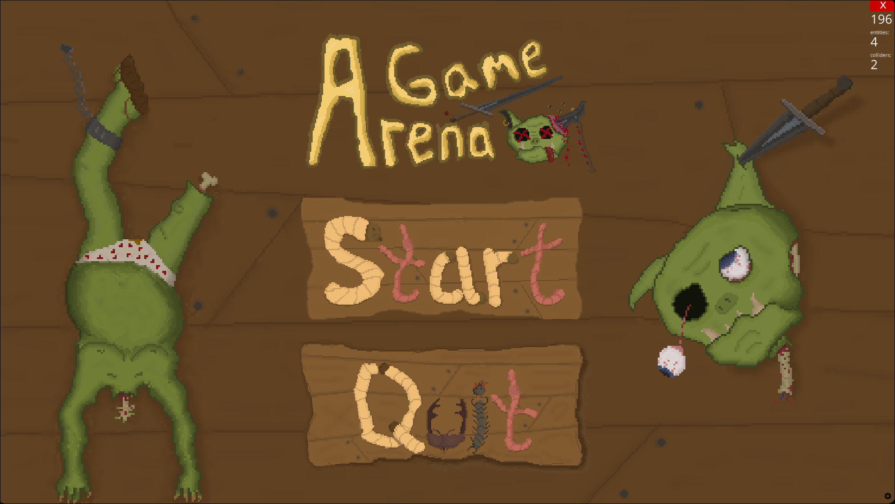
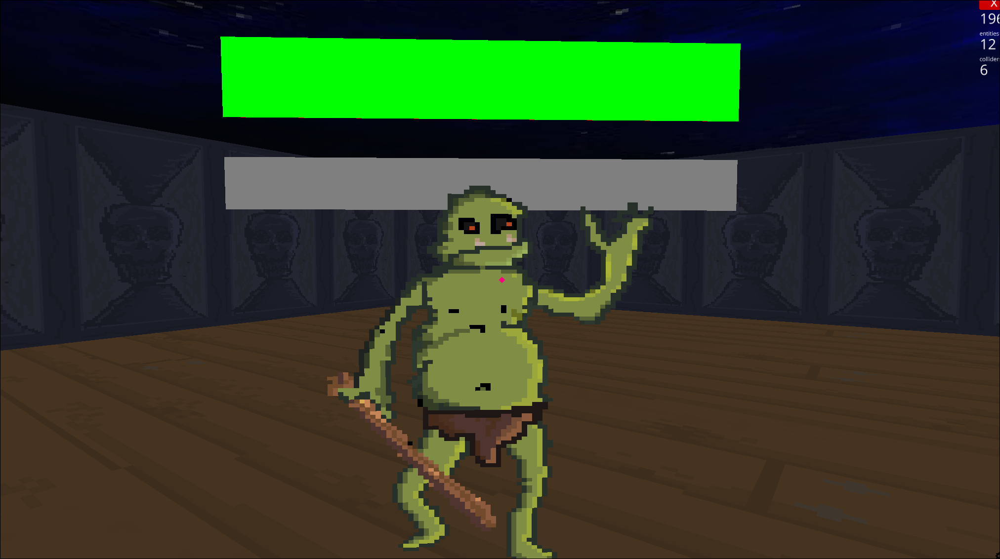

# Game Arene

Game Arene is a simple arena shooter where the player can test and experience different mechanics. This is my first project using this engine, so the main goal of the project is to get familiar with the engine and adapt to its workflow. The game is built with **Ursina Engine** in Python. All textures and sprites were created using **Aseprite**.

---

## Technologies Used

- **Python** — main programming language
- **Ursina Engine** — game engine for 3D/2D rendering and game logic
- **Aseprite** — for creating textures and sprites

---

## Screenshot

---

This project serves as a practice to experiment with game mechanics and learn the engine workflow.
